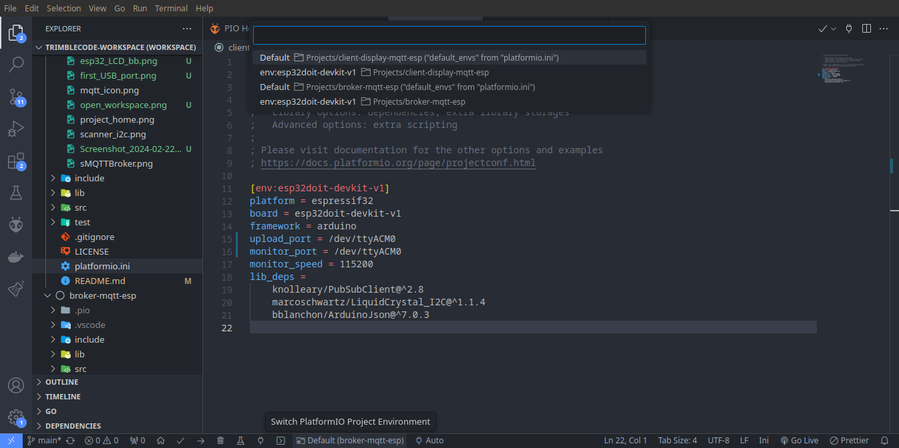
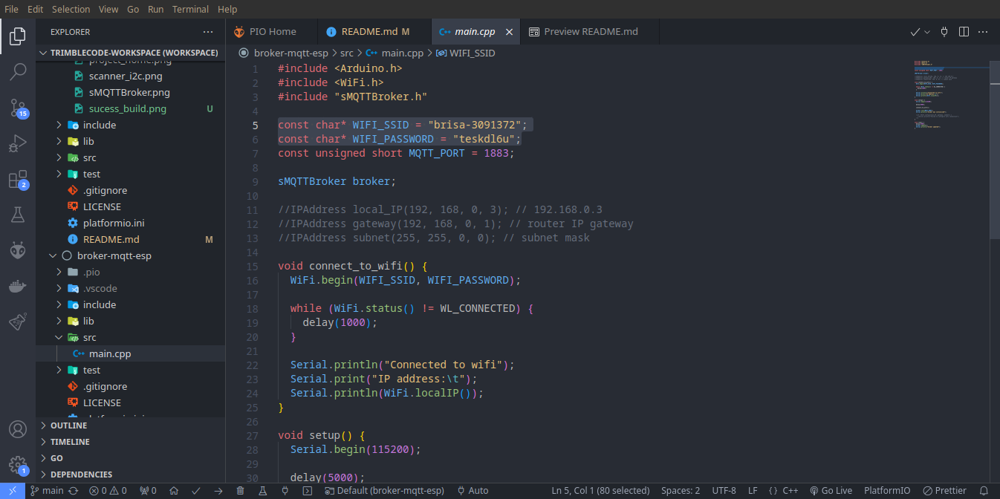

# client-display-mqtt-esp
Display controled by ESP32 using MQTT protocol

<a name="readme-top"></a>

[![MIT License][license-shield]][license-url]
[![LinkedIn][linkedin-shield]][linkedin-url]

<!-- PROJECT LOGO -->
<br />
<div align="center">
  <a href="https://github.com/Samuel-Jonas/client-display-mqtt-esp">
    
  </a>

  <h3 align="center">ESP32 MQTT Broker</h3>

  <p align="center">
    A challenge for Embedded Software Engineer Junior role
    <br />
    <a href="https://github.com/Samuel-Jonas/client-display-mqtt-esp>
    <strong>Explore the docs »</strong>
    </a>
    <br />
    <br />
    <a href="https://github.com/Samuel-Jonas/client-display-mqtt-esp">View Demo</a>
    ·
    <a href="https://github.com/Samuel-Jonas/sensor-flow">Another project</a>
    ·
    <a href="https://github.com/Samuel-Jonas/broker-mqtt-esp">Releated Project</a>
  </p>
</div>


<!-- TABLE OF CONTENTS -->
<details>
  <summary>Table of Contents</summary>
  <ol>
    <li>
      <a href="#about-the-project">About The Project</a>
    </li>
    <li>
      <a href="#getting-started">Getting Started</a>
      <ul>
        <li><a href="#prerequisites">Prerequisites</a></li>
        <li><a href="#installation">Installation</a></li>
      </ul>
    </li>
    <li><a href="#usage">Usage</a></li>
    <li><a href="#roadmap">Roadmap</a></li>
    <li><a href="#contributing">Contributing</a></li>
    <li><a href="#license">License</a></li>
    <li><a href="#contact">Contact</a></li>
    <li><a href="#acknowledgments">Acknowledgments</a></li>
  </ol>
</details>


<!-- ABOUT THE PROJECT -->
## About The Project

[![MQTT Broker ESP32][product-screenshot]](https://github.com/Samuel-Jonas/client-display-mqtt-esp)

To develop quickly I decided to abstract the responsibilities of building with makefile to this VSCode extension, so I just need to focus on the evaluation requirements and improve my README file for a better explanation.

Assessment requirements:

> 1. Select a target hardware platform (e.g., Raspberry Pi, BeagleBone, etc.)
>
> 2. Configure it to have a mosquitto (MQTT) local broker running.
>
> 3. Develop a Hardware Abstraction Layer (HAL) header file to abstract the display.
>
> 4. Develop a library that implements the HAL for the selected display, based on the communication > protocol it uses.
>
> 5. Develop a program and link it to the created library. It should listen to the "/test/trimble" MQTT topic, and every time a json message in the format "{ "print": "MESSAGE" }" is received it should print the message into the display.
>
> 6. Develop another program that publishes the amount of seconds it has been running in the "/test/trimble" MQTT topic every 10 seconds, so that the information is printed on the display.
>
> 7. Write unit tests for your code.

Briefly for my solution to be accordingly with the assessment requirements I've been assuming this:

* I'm using ESP32 DevKit V1 as the target hardware platform.

* To configure a broker running on ESP32 I'm just using the library **sMQTTBroker.h**.

* An LCD display 16x2 with an I2C module will be used to display the content of this JSON format.
```json
{ 
    "print": "MESSAGE" 
}
```

* The consumer that will be using the LCD display is not on the same hardware platform as the 
broker and must be subscribed in the topic "test/trimble".

* The publisher can be a simple program in any programming language designed to publish the message, which will be the amount of seconds that this program has been running but only publish every 10 seconds in the topic "test/trimble".

<p align="right">(<a href="#readme-top">back to top</a>)</p>

<!-- GETTING STARTED -->
## Getting Started

To get a local copy up and running follow these simple example steps.

### Prerequisites

#### You will need of 2 ESP32 DevKit V1 like the image below.

<div>
  
  
</div>

#### The Display used is an LCD Display 16x2 with a module I2C welded

<div>
  
</div>

#### Wiring for the display and the ESP32

<style>
  .rnthl {
    padding-left: 4px;
    padding-right: 4px;
    margin-left: 4px;
    margin-right: 4px;
    border-radius: 4px;
    margin: 0;
    color: #fff;
    display: inline-block;
  }

  .rntcblack {
    background-color: #333;
  }

  .rntcred {
    background-color: #c33;
    color: #fff !important;
  }

  .rntcgreen {
    background-color: #090;
  }

  .rntcblue {
    background-color: #06c;
  }

  table {
    border-collapse: separate;
    border-spacing: 0;
    border-width: 1px 0 0 1px;
    margin: 0 0 1.5em;
    width: 100%;
  }

  table, td, th {
    border: 1px solid rgba(0,0,0,.1);
    border-top-width: 1px;
    border-right-width: 1px;
    border-bottom-width: 1px;
    border-left-width: 1px;
  }

  .container {
      display: inline-block;
  }

  img {
    display: inline-block;
    vertical-align: middle; /* Align vertically in the middle */
  }

  table {
    display: inline-block;
    vertical-align: middle; /* Align vertically in the middle */
    margin-left: 10px; /* Add margin for spacing */
  }
</style>

<div class="container">
  

  <br>

  The table below brings an overview about the wiring.

  <table>
    <tbody>
      <tr>
        <td><strong>I2C LCD</strong></td>
        <td><strong>ESP32</strong></td>
      </tr>
      <tr>
        <td><span style="font-weight: 400;">GND</span></td>
        <td><span class="rnthl rntcblack" style="font-weight: 400;">GND</span></td>
      </tr>
      <tr>
        <td><span style="font-weight: 400;">VCC</span></td>
        <td><span class="rnthl rntcred" style="font-weight: 400;">VIN</span></td>
      </tr>
      <tr>
        <td><span style="font-weight: 400;">SDA</span></td>
        <td><span class="rnthl rntcgreen" style="font-weight: 400;">GPIO 21</span></td>
      </tr>
      <tr>
        <td><span style="font-weight: 400;">SCL</span></td>
        <td><span class="rnthl rntcblue" style="font-weight: 400;">GPIO 22</span></td>
      </tr>
    </tbody>
  </table>
</div>

#### You will need VS Code installed on your machine. Follow the steps to install clicking <a href="https://code.visualstudio.com/docs/setup/setup-overview">here</a>.

#### Install PlatformIO extension for VS Code. Check the steps <a href="https://platformio.org/install">here</a>. 

#### Download and install MQTT Explorer <a href="http://mqtt-explorer.com/">here</a>. 

### Installation

_Below are the instructions to download and run the application. Please clone both in the same folder._

1. Clone the client repo
   ```sh
   git clone https://github.com/Samuel-Jonas/client-display-mqtt-esp.git
   ```
2. Clone the MQTT broker repo
   ```sh
   git clone https://github.com/Samuel-Jonas/broker-mqtt-esp.git
   ```

<p align="right">(<a href="#readme-top">back to top</a>)</p>

<!-- USAGE EXAMPLES -->
## Usage

_Follow these steps to use the project and check the feature._

1. Connect the first ESP32 into some USB port on your machine. You need a USB cable.

2. Search the port name related to your device. On Arch Linux I use this:
<br>
<br>

<br>
<br>

3. Open **trimblecode-workspace.code-workspace** file with VS Code.
<br>
<br>

<br>
<br>

4. Open the broker-mqtt-esp project and replace the value afer '=' of monitor_port and upload_port with related to step 2 in the file **platformio.ini**.
<br>
<br>

<br>
<br>

5. Make sure that Switch PlatformIO Project Environment is set to broker-mqtt-esp
<br>
<br>

<br>
<br>

6. Configure the Wifi name and password in broker-mqtt-esp/src/main.cpp
<br>
<br>

<br>
<br>

7. Build the project.
<br>
<br>

<br>
<br>

8. Check if the build finish successfully.
<br>
<br>

<br>
<br>

9. Now flash the firmware into the ESP32. Check in the terminal window if was uploaded successfully.
<br>
<br>

<br>
<br>

10. See the serial monitor to get the IP address from broker.
<br>
<br>

<br>
<br>

>> In fact you have an MQTT broker running into ESP32.
>>
>> Once the broker was configured and still running you can continue the process to build and flash the second project called <br>client-diplay-mqtt-esp but before, we will use MQTT Explorer as the publisher program and test our broker connection.

11. Open your MQTT Explorer. Mine open this way:
<br>
<br>

<br>
<br>

12. Configure your MQTT Explorer connection to that IP address catched in step 10.
<br>
<br>

<br>
<br>

<p align="right">(<a href="#readme-top">back to top</a>)</p>


<!-- ROADMAP -->
## Roadmap

- [x] Select a target hardware platform (e.g., Raspberry Pi, BeagleBone, etc.)
- [x] Configure it to have a mosquitto (MQTT) local broker running.
- [ ] Develop a Hardware Abstraction Layer (HAL) header file to abstract the display.
- [ ] Develop a library that implements the HAL for the selected display.
- [x] Develop a program that listen to the "/test/trimble" MQTT topic, and print the message into the display.
- [ ] Develop another program that publishes the message in format "{ "print": "MESSAGE" }".
- [ ] Write unit tests for your code.

<p align="right">(<a href="#readme-top">back to top</a>)</p>


<!-- CONTRIBUTING -->
## Contributing

Contributions are what make the open source community such an amazing place to learn, inspire, and create. Any contributions you make are **greatly appreciated**.

If you have a suggestion that would make this better, please fork the repo and create a pull request. You can also simply open an issue with the tag "enhancement".
Don't forget to give the project a star! Thanks again!

1. Fork the Project
2. Create your Feature Branch (`git checkout -b feature/AmazingFeature`)
3. Commit your Changes (`git commit -m 'Add some AmazingFeature'`)
4. Push to the Branch (`git push origin feature/AmazingFeature`)
5. Open a Pull Request

<p align="right">(<a href="#readme-top">back to top</a>)</p>


<!-- LICENSE -->
## License

Distributed under the MIT License. See `LICENSE.txt` for more information.

<p align="right">(<a href="#readme-top">back to top</a>)</p>


<!-- CONTACT -->
## Contact

Your Name - [@your_twitter](https://twitter.com/your_username) - email@example.com

Project Link: [https://github.com/your_username/repo_name](https://github.com/your_username/repo_name)

<p align="right">(<a href="#readme-top">back to top</a>)</p>


<!-- ACKNOWLEDGMENTS -->
## Acknowledgments

Use this space to list resources you find helpful and would like to give credit to. I've included a few of my favorites to kick things off!

* [Choose an Open Source License](https://choosealicense.com)
* [GitHub Emoji Cheat Sheet](https://www.webpagefx.com/tools/emoji-cheat-sheet)
* [Malven's Flexbox Cheatsheet](https://flexbox.malven.co/)
* [Malven's Grid Cheatsheet](https://grid.malven.co/)
* [Img Shields](https://shields.io)
* [GitHub Pages](https://pages.github.com)
* [Font Awesome](https://fontawesome.com)
* [React Icons](https://react-icons.github.io/react-icons/search)

<p align="right">(<a href="#readme-top">back to top</a>)</p>


<!-- MARKDOWN LINKS & IMAGES -->
<!-- https://www.markdownguide.org/basic-syntax/#reference-style-links -->
[contributors-shield]: https://img.shields.io/github/contributors/othneildrew/Best-README-Template.svg?style=for-the-badge
[contributors-url]: https://github.com/othneildrew/Best-README-Template/graphs/contributors
[forks-shield]: https://img.shields.io/github/forks/othneildrew/Best-README-Template.svg?style=for-the-badge
[forks-url]: https://github.com/othneildrew/Best-README-Template/network/members
[stars-shield]: https://img.shields.io/github/stars/othneildrew/Best-README-Template.svg?style=for-the-badge
[stars-url]: https://github.com/Samuel-Jonas/broker-mqtt-esp/stargazers
[issues-shield]: https://img.shields.io/github/issues/othneildrew/Best-README-Template.svg?style=for-the-badge
[issues-url]: https://github.com/Samuel-Jonas/broker-mqtt-esp/issues
[license-shield]: https://img.shields.io/github/license/othneildrew/Best-README-Template.svg?style=for-the-badge
[license-url]: https://github.com/Samuel-Jonas/broker-mqtt-esp/blob/main/LICENSE
[linkedin-shield]: https://img.shields.io/badge/-LinkedIn-black.svg?style=for-the-badge&logo=linkedin&colorB=555
[linkedin-url]: https://www.linkedin.com/in/samuel-jonas
[product-screenshot]: images/project_home.png
[Next.js]: https://img.shields.io/badge/next.js-000000?style=for-the-badge&logo=nextdotjs&logoColor=white
[Next-url]: https://nextjs.org/
[React.js]: https://img.shields.io/badge/React-20232A?style=for-the-badge&logo=react&logoColor=61DAFB
[React-url]: https://reactjs.org/
[Vue.js]: https://img.shields.io/badge/Vue.js-35495E?style=for-the-badge&logo=vuedotjs&logoColor=4FC08D
[Vue-url]: https://vuejs.org/
[Angular.io]: https://img.shields.io/badge/Angular-DD0031?style=for-the-badge&logo=angular&logoColor=white
[Angular-url]: https://angular.io/
[Svelte.dev]: https://img.shields.io/badge/Svelte-4A4A55?style=for-the-badge&logo=svelte&logoColor=FF3E00
[Svelte-url]: https://svelte.dev/
[Laravel.com]: https://img.shields.io/badge/Laravel-FF2D20?style=for-the-badge&logo=laravel&logoColor=white
[Laravel-url]: https://laravel.com
[Bootstrap.com]: https://img.shields.io/badge/Bootstrap-563D7C?style=for-the-badge&logo=bootstrap&logoColor=white
[Bootstrap-url]: https://getbootstrap.com
[JQuery.com]: https://img.shields.io/badge/jQuery-0769AD?style=for-the-badge&logo=jquery&logoColor=white
[JQuery-url]: https://jquery.com 
